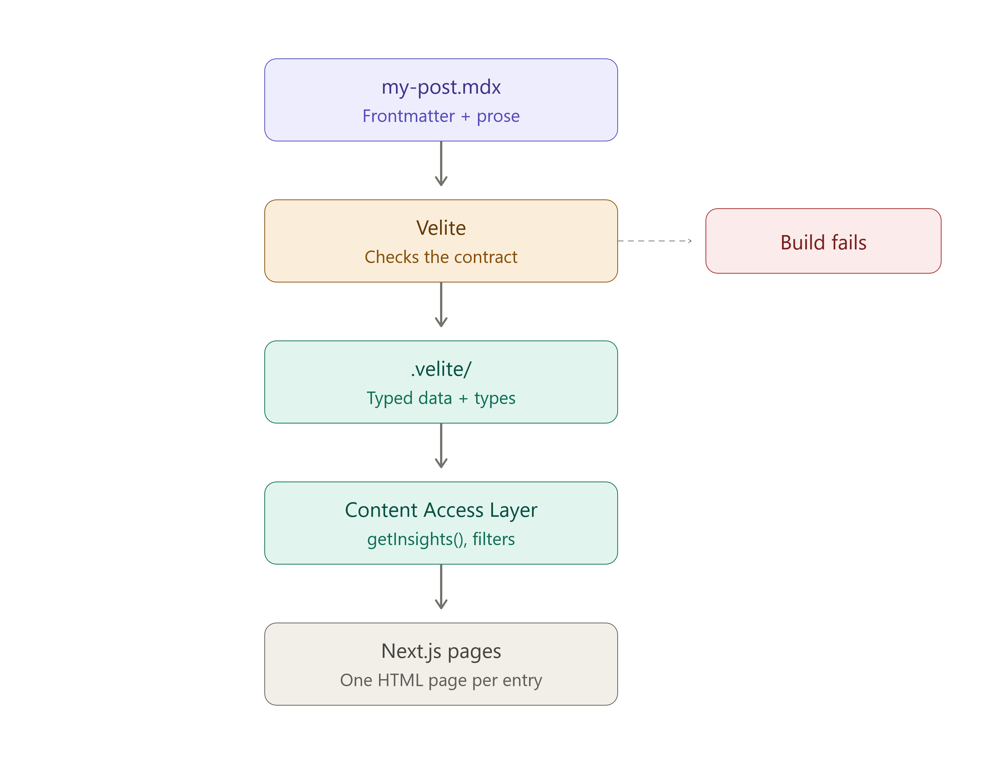

Today my CI pipeline hit a roadblock during the `typecheck` step, throwing a frustrating error: `Cannot find module '#velite' or its corresponding type declarations.`

Interestingly, everything worked perfectly on my local machine. So, what went wrong in the cloud?

### The Aha! Moment: The Missing Directory

It turns out this was my very first time using **Velite**, and I completely overlooked a fundamental characteristic of its architecture. Velite is a statically generated content layer. It relies on a build-time codegen step to scan MDX files, validate them, and dynamically spit out TypeScript types and data artifacts into a hidden `.velite/` directory.

In my GitHub Actions workflow, `npm run typecheck` (which triggers `tsc --noEmit`) was running *before* Velite ever had a chance to execute. Since the `.velite/` folder didn't exist yet on the clean CI runner, TypeScript couldn't resolve the `#velite` path alias, causing the entire compilation to collapse.

### Understanding the Pipeline

Visualizing the pipeline makes it clear why order of execution matters:



Velite acts as a lightweight yet incredibly strict **Contract Guard**. If an author writes an MDX post that violates the Zod schemas configured in `velite.config.ts` (e.g., a missing required field or an invalid tag), Velite instantly rejects it. The build fails early in the CI gate, ensuring corrupted or malformed content can never leak into the production S3 bucket and CloudFront distribution.

### The Fix

Every npm script should prepare its own prerequisites. To prevent `tsc` from running blindly, we can tie the codegen directly into the typecheck script within `package.json`:

```json
"typecheck": "velite && tsc --noEmit"
```

Alternatively, we can explicitly invoke the generation step right before the typecheck in our GitHub Actions workflow (`ci.yml`):

```yaml
- name: Generate Velite collections
  run: npx velite build

- name: Typecheck
  run: npm run typecheck
```

### Strict ESLint Rules vs. Lax Typing

During the debug session, I tried a classic developer shortcut to bypass the initial parameter type errors by introducing an explicit `any` (e.g., `.map((t: any) => ...)`).

While this successfully appeased `tsc`, it immediately triggered an angry alarm from the project's strict ESLint linter:

```
Error: Unexpected any. Specify a different type.  @typescript-eslint/no-explicit-any
```

This reminded me of the beauty of this stack: between ESLint rejecting sloppy code and Velite rejecting non-compliant content schemas, the pathway to Production is heavily fortified. The best solution was to either import the proper auto-generated type from Velite (`import { type Insight } from '#velite'`) or let TypeScript's powerful type inference handle the implicitly mapped elements natively without annotations.

Lesson learned: Respect the compilation lifecycle, embrace strict linter gates, and let your content layer generate its types before asking compiler tools to inspect them!